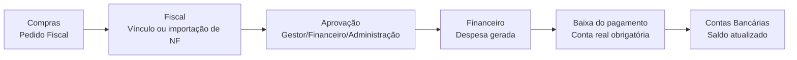
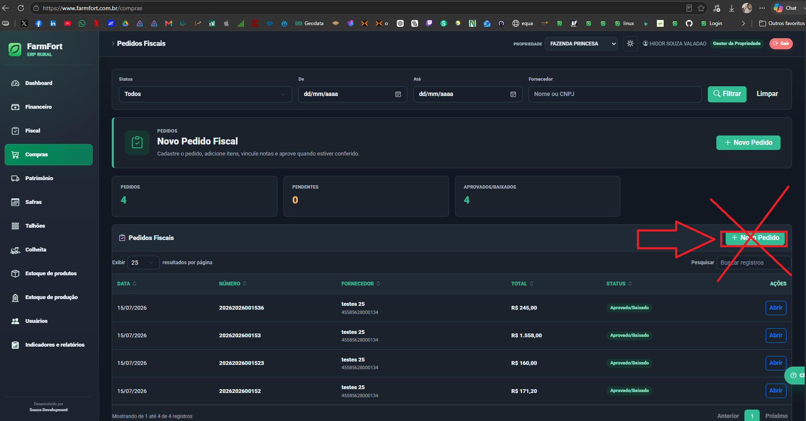
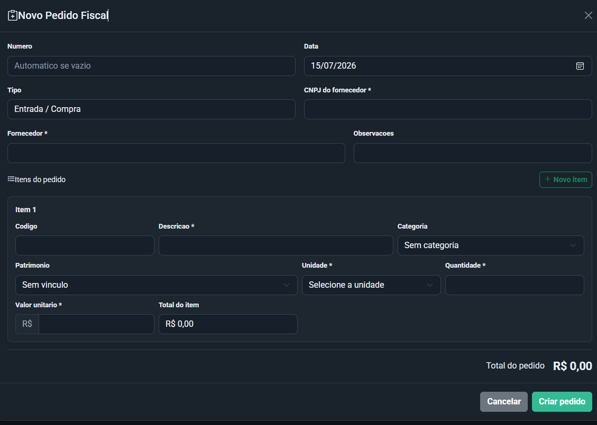
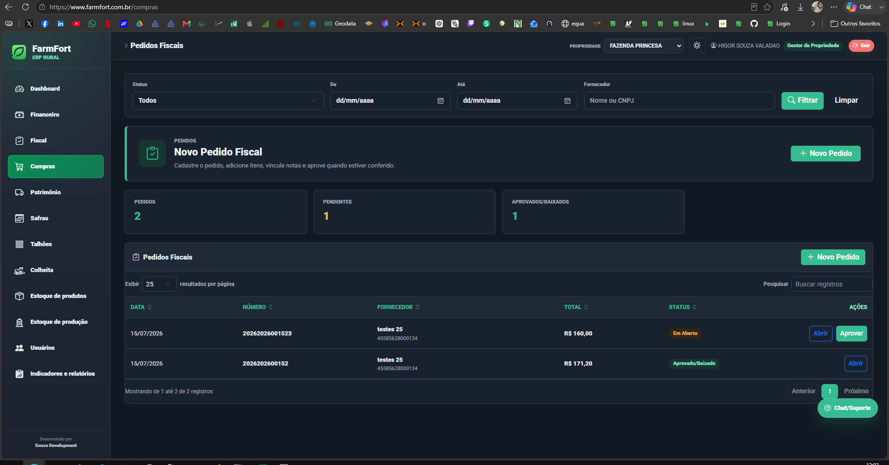
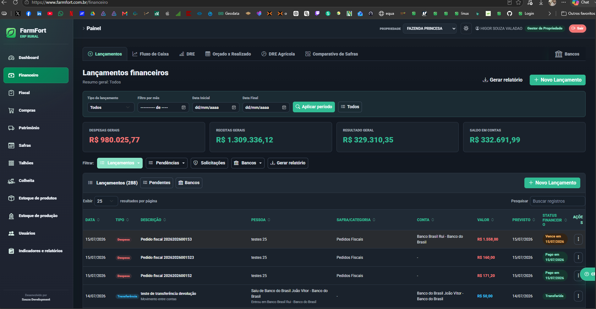
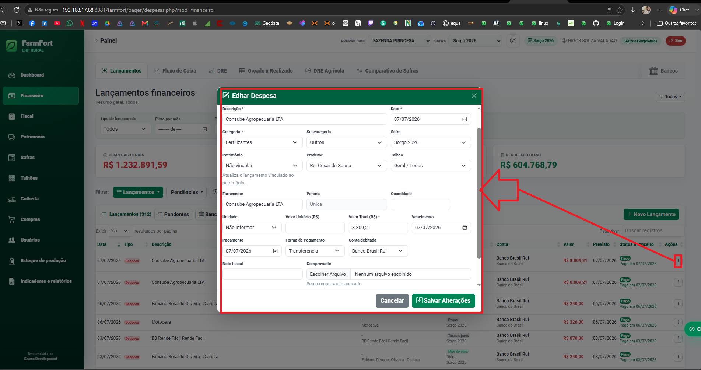
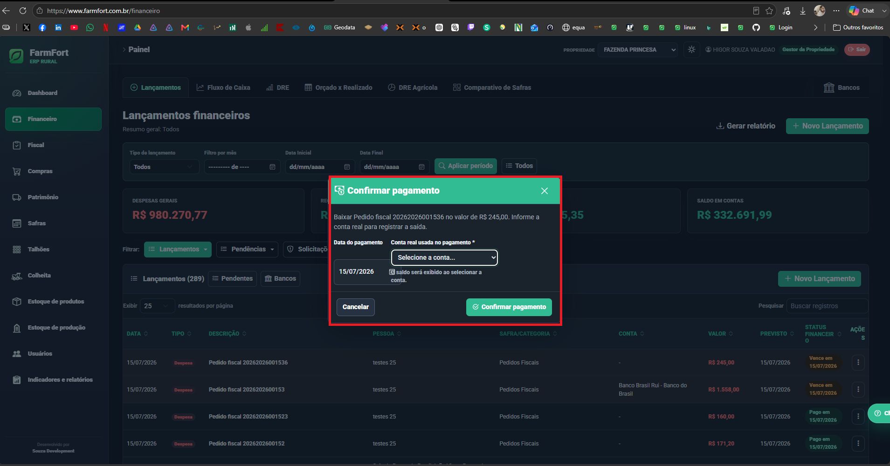
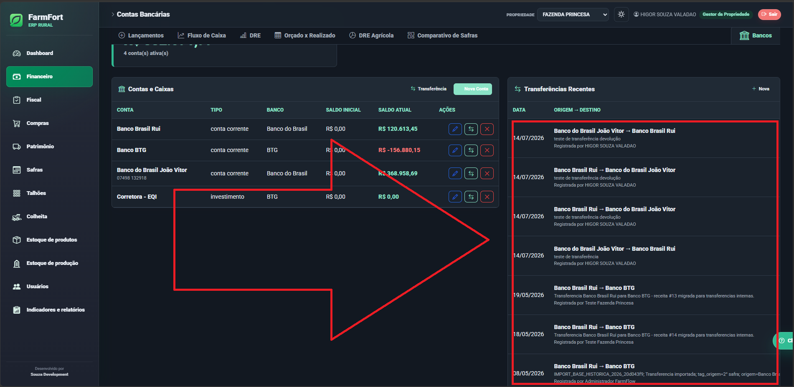

# Instruções de trabalho — Compras, Fiscal e Financeiro

Documento criado para orientar o uso do fluxo de **Pedidos Fiscais**, integração com **Notas Fiscais** e geração/baixa de lançamentos no **Financeiro**.

## Objetivo do fluxo

O fluxo separa três momentos que não devem ser misturados:

1. **Pedido fiscal**: registra a intenção ou confirmação de compra.
2. **Nota fiscal**: comprova fiscalmente a compra e permite conferência com o pedido.
3. **Financeiro**: controla vencimento, pagamento, conta bancária usada e saldo.

Essa separação evita que uma compra seja lançada como paga sem conferência, ou que uma nota fiscal seja tratada como pagamento.



## 1. Tela de Pedidos Fiscais

A tela principal fica em **Compras > Pedidos Fiscais**. Ela centraliza filtros, resumo dos pedidos, lista de pedidos e acesso ao cadastro.



### O que verificar nessa tela

- **Filtros**: status, período e fornecedor.
- **Resumo**:
  - pedidos totais;
  - pedidos pendentes;
  - pedidos aprovados/baixados.
- **Lista de pedidos**:
  - data;
  - número;
  - fornecedor;
  - total;
  - status;
  - ações.

### Status principais

| Status | Significado |
| --- | --- |
| Em aberto | Pedido criado, ainda não finalizado/aprovado. |
| Aguardando aprovação | Pedido criado por perfil operacional ou aguardando conferência. |
| Aprovado/Baixado | Pedido aprovado e já transformado em lançamento financeiro. |
| Rejeitado | Pedido recusado antes de gerar lançamento financeiro. |

## 2. Criar pedido fiscal

Clique em **+ Novo Pedido** para abrir o modal de cadastro.



### Campos principais

- número do pedido, quando houver;
- data;
- tipo;
- CNPJ do fornecedor;
- fornecedor;
- observações;
- itens do pedido;
- categoria;
- patrimônio, quando o item estiver ligado a patrimônio;
- unidade;
- quantidade;
- valor unitário;
- total do item.

### Regras de preenchimento

- O número pode ser automático quando ficar em branco.
- O fornecedor e o CNPJ precisam representar quem emitiu ou emitirá a nota.
- Cada item deve ter descrição, unidade, quantidade e valor.
- Quando houver patrimônio envolvido, selecione o patrimônio para manter o histórico correto.
- O total do pedido é a soma dos itens.

## 3. Aprovação por perfil

Usuários de gestão, financeiro ou administração podem aprovar pedidos da propriedade.

Usuários operacionais podem criar pedidos, mas o pedido fica pendente para o gestor conferir.



### Regra recomendada

- Se o pedido for criado por usuário operacional, o gestor confere e aprova.
- Se o pedido for criado por gestor, financeiro ou administrador, a aprovação pode ser feita no próprio fluxo.
- Se o pedido tiver nota fiscal para conferir, faça o vínculo da NF antes de aprovar.

## 4. Integração com o Fiscal e notas fiscais

Quando o pedido possui nota fiscal, a NF deve ser vinculada ao pedido antes da aprovação sempre que possível.

### Formas de vínculo

- selecionar uma NF já lançada no Fiscal;
- importar XML de NF-e para conferência;
- comparar os itens da NF com os itens do pedido;
- confirmar o vínculo se a conferência estiver correta;
- rejeitar ou corrigir quando a NF estiver incorreta.

### O que a conferência deve observar

- CNPJ do fornecedor;
- valor total;
- itens;
- quantidade;
- valor unitário;
- diferenças entre pedido e nota.

### Confirmação sem NF

Se o usuário tentar aprovar um pedido sem NF vinculada, o sistema deve reforçar a confirmação.

Use essa aprovação somente quando:

- a operação realmente não precisa de NF no momento;
- a NF será recebida depois;
- o gestor assume a responsabilidade pela aprovação sem vínculo fiscal.

### Confirmação com divergência

Se houver divergência entre pedido e nota fiscal, o sistema deve pedir confirmação reforçada.

Antes de confirmar, confira:

- item divergente;
- valor divergente;
- quantidade divergente;
- fornecedor divergente;
- total divergente.

Se a divergência for erro real, corrija o pedido ou a NF antes de aprovar.

## 5. Rejeição de pedido e rejeição de NF

### Quando rejeitar um pedido

Rejeite o pedido quando:

- foi criado por engano;
- o fornecedor está incorreto;
- os itens não conferem;
- o valor está incorreto;
- a compra não foi autorizada;
- a NF vinculada não corresponde ao pedido.

### Quando rejeitar uma NF

Rejeite a NF quando:

- não pertence à propriedade;
- o fornecedor está errado;
- o XML é inválido para a compra;
- a nota não confere com o pedido;
- a nota foi enviada por engano.

### Auditoria da rejeição

A rejeição registra:

- usuário que rejeitou;
- data e hora;
- pedido ou NF afetada;
- propriedade;
- motivo, quando informado.

## 6. Geração do lançamento financeiro

Ao aprovar o pedido, o sistema gera uma despesa no módulo Financeiro.



### O que é levado para o Financeiro

- descrição do pedido;
- fornecedor;
- categoria;
- valor;
- vencimento;
- forma de pagamento;
- conta prevista, quando informada;
- referência do pedido fiscal;
- referência da NF vinculada, quando existir.

### Ponto importante

A aprovação do pedido **não significa que o pagamento já saiu da conta**.

O pedido aprovado gera a despesa. A baixa do pagamento é outra etapa.

## 7. Conferir ou editar a despesa gerada

Depois da aprovação, o usuário pode abrir a despesa para revisar os dados financeiros.



### Campos que devem ser conferidos

- descrição;
- data;
- categoria;
- subcategoria;
- safra;
- patrimônio;
- produtor;
- talhão;
- fornecedor;
- valor total;
- vencimento;
- pagamento;
- forma de pagamento;
- conta debitada;
- nota fiscal;
- comprovante.

### Regra operacional

Enquanto o dinheiro ainda não saiu da conta, mantenha a despesa como pendente.

Marque como paga somente quando o pagamento realmente acontecer.

## 8. Baixar pagamento com conta real

Na baixa do pagamento, o sistema exige a conta real usada para pagar.



### Por que a conta real é obrigatória

A conta real atualiza o saldo bancário e mantém o relatório financeiro confiável.

Sem essa informação, o sistema não sabe de qual banco, caixa ou conta saiu o dinheiro.

### Conferência antes de confirmar

Antes de confirmar o pagamento:

1. confira o valor;
2. selecione a conta real;
3. confira o saldo exibido;
4. observe avisos de saldo negativo ou saldo insuficiente;
5. confirme apenas se a conta estiver correta.

## 9. Contas bancárias e transferências

A tela de Contas Bancárias mostra o saldo total, contas e transferências recentes.



### Como o saldo da conta é calculado

```text
saldo atual =
saldo inicial
+ receitas recebidas na conta
- despesas pagas na conta
- transferências onde a conta é origem
+ transferências onde a conta é destino
```

### O que entra como movimentação

- pagamento de despesa;
- recebimento de receita;
- transferência entre contas;
- saldo inicial cadastrado.

### O que não deve acontecer

- transferência não deve virar receita;
- transferência não deve virar despesa;
- pagamento não deve ficar sem conta real;
- despesa paga não deve ser baixada em conta errada.

## 10. Relatório de entradas e saídas das contas

Para acompanhar as contas, o relatório deve mostrar:

- data;
- conta;
- tipo de movimento;
- origem;
- destino;
- descrição;
- valor de entrada;
- valor de saída;
- saldo após o movimento;
- vínculo com pedido fiscal, NF, receita, despesa ou transferência.

### Leitura recomendada

- **Entrada**: dinheiro entrou na conta.
- **Saída**: dinheiro saiu da conta.
- **Transferência**: saiu de uma conta e entrou em outra.
- **Pagamento de pedido**: saiu da conta vinculada à despesa gerada pelo pedido.

## 11. Auditoria

O fluxo deve registrar auditoria nas ações críticas:

- criação do pedido fiscal;
- edição do pedido fiscal;
- vínculo de NF;
- rejeição de pedido;
- rejeição de NF;
- aprovação do pedido;
- geração da despesa financeira;
- baixa do pagamento;
- conta usada na baixa.

### Informação sensível

Nunca registrar senha, token, chave privada ou dado sensível no campo de detalhes da auditoria.

## 12. Fluxo operacional recomendado

1. Criar pedido em **Compras > Pedidos Fiscais**.
2. Informar fornecedor, CNPJ e itens.
3. Vincular ou importar NF, se houver.
4. Conferir divergências.
5. Aprovar ou rejeitar o pedido.
6. Conferir a despesa criada no Financeiro.
7. Ajustar vencimento, categoria, forma de pagamento e conta prevista, se necessário.
8. Baixar pagamento somente quando o dinheiro sair.
9. Selecionar a conta real.
10. Conferir saldo e confirmar.
11. Consultar contas bancárias e auditoria quando necessário.

## 13. Resumo por perfil

| Perfil | Pode criar pedido | Pode aprovar | Pode rejeitar | Pode baixar pagamento |
| --- | --- | --- | --- | --- |
| Gestor da propriedade | Sim | Sim | Sim | Sim |
| Financeiro | Sim | Sim | Sim | Sim |
| Administração | Sim | Sim | Sim | Sim |
| Operacional/colaborador | Sim | Não, salvo permissão específica | Não, salvo permissão específica | Não, salvo permissão específica |
| Visualizador | Não | Não | Não | Não |

## 14. Boas práticas

- Não aprove pedido sem conferir fornecedor e valor.
- Não baixe pagamento sem conta real.
- Não vincule NF de outra propriedade.
- Não ignore divergência sem justificativa.
- Não transforme transferência entre contas em receita ou despesa.
- Sempre confira saldo da conta antes de confirmar pagamento.
- Use a auditoria para rastrear decisões importantes.

