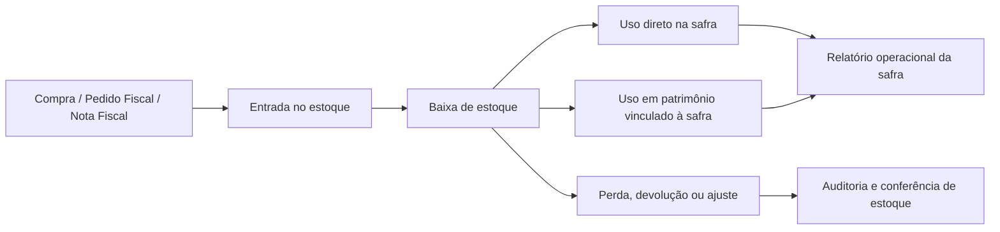
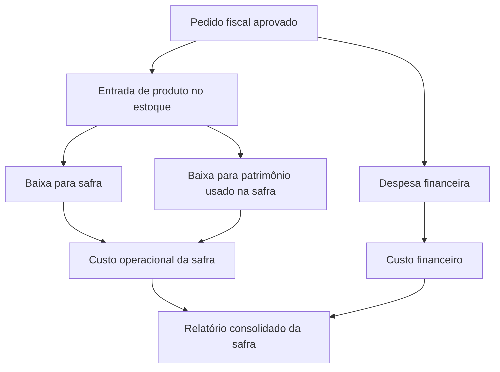

# Instrução de Trabalho — Baixa de Estoque com Rastreabilidade por Safra

## Objetivo

Esta rotina organiza a saída de produtos do estoque do FarmFort, mantendo rastreabilidade entre compra, estoque, safra, talhão, patrimônio e financeiro.

Ela deve ser usada quando um produto comprado e lançado no estoque for consumido na operação da fazenda, por exemplo:

- insumo aplicado em uma safra;
- peça usada em manutenção de máquina;
- óleo diesel usado por um patrimônio em determinada safra;
- perda, devolução ou ajuste operacional de estoque.

## Visão geral do fluxo

## Quando usar

Use a baixa de estoque sempre que o produto deixar de estar disponível para uso geral.

Exemplos práticos:

- fertilizante comprado e aplicado na safra Soja 2026/2027;
- semente retirada do estoque para plantio;
- pneu comprado e instalado em um trator usado na safra Sorgo 2026;
- óleo diesel abastecido em um trator que trabalhou em uma safra;
- produto perdido, devolvido ao fornecedor ou ajustado em inventário.

## Como registrar a baixa

1. Acesse **Estoque de produtos**.
2. Localize o produto.
3. Clique em **Dar baixa**.
4. Escolha o destino da baixa.
5. Informe a quantidade e a data.
6. Preencha os campos obrigatórios do destino escolhido.
7. Clique em **Registrar baixa**.

## Destinos disponíveis

### 1. Uso direto em safra/talhão

Use quando o produto foi aplicado diretamente na lavoura.

Campos principais:

- safra;
- talhão, quando a baixa for específica de um talhão;
- quantidade;
- data da baixa;
- observações, quando necessário.

Exemplo:

> Baixar 500 kg de fertilizante para a safra Soja 2026/2027 no talhão Abertura 1.

### 2. Uso em patrimônio

Use quando o produto foi consumido por uma máquina, veículo, implemento ou outro patrimônio.

Campos principais:

- safra;
- patrimônio;
- talhão, quando o uso estiver ligado a um talhão específico;
- quantidade;
- data da baixa;
- observações.

Ao registrar essa baixa, o sistema também cria um lançamento operacional no patrimônio, mantendo o vínculo com a safra.

Exemplo:

> Baixar 1 pneu do estoque para o trator John Deere usado na safra Sorgo 2026.

Outro exemplo:

> Baixar 200 litros de diesel para a caminhonete usada nas atividades da safra Soja 2026/2027.

### 3. Perda, devolução ou ajuste

Use quando a saída não representa consumo produtivo.

Campos principais:

- motivo;
- quantidade;
- data da baixa;
- observações.

Exemplos:

- produto vencido;
- devolução ao fornecedor;
- ajuste de inventário;
- perda operacional.

## O que o sistema registra

Ao confirmar a baixa, o FarmFort registra:

- produto baixado;
- quantidade;
- unidade;
- valor estimado pelo custo médio do estoque;
- safra vinculada, quando aplicável;
- talhão vinculado, quando aplicável;
- patrimônio vinculado, quando aplicável;
- motivo, quando for ajuste;
- usuário responsável;
- data da baixa;
- auditoria da operação.

## Como isso fecha o ciclo da safra

Com esse fluxo, a safra passa a ter duas visões complementares:

- **financeira**, mostrando quanto foi comprado e pago;
- **operacional**, mostrando o que realmente foi usado.

Assim é possível responder perguntas como:

- Quanto de fertilizante foi comprado?
- Quanto foi realmente usado na safra?
- Qual patrimônio consumiu peças ou combustível?
- Qual talhão recebeu determinado produto?
- Qual custo saiu do estoque e foi apropriado na safra?

## Recomendações operacionais

1. Cadastre produtos com unidade correta.
2. Confira a entrada no estoque ao aprovar pedidos ou importar notas.
3. Dê baixa no momento em que o produto for usado.
4. Sempre vincule a safra quando o consumo estiver ligado a produção.
5. Vincule patrimônio quando o produto for peça, combustível, lubrificante ou manutenção.
6. Use observações para detalhes que ajudem a auditoria.
7. Não use ajuste operacional para consumo produtivo normal.

## Relatórios esperados

Com as baixas registradas, o sistema pode gerar relatórios como:

- estoque comprado versus estoque usado por safra;
- insumos aplicados por safra;
- insumos aplicados por talhão;
- peças usadas por patrimônio;
- combustível consumido por patrimônio e safra;
- perdas e ajustes de estoque;
- custo operacional consolidado da safra.

## Controle e auditoria

Toda baixa deve ser rastreável. O sistema registra auditoria da operação e nunca deve ocultar falhas silenciosamente.

Quando houver erro de saldo, destino ou permissão, o usuário deve receber uma mensagem clara para corrigir antes de confirmar.
