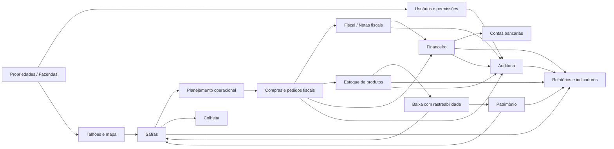
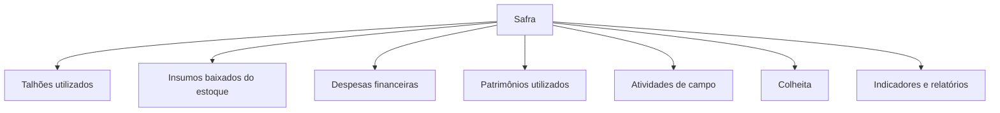
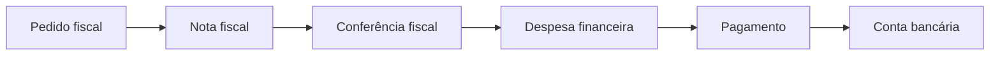
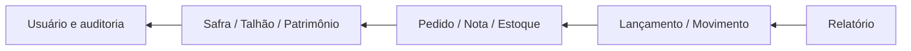
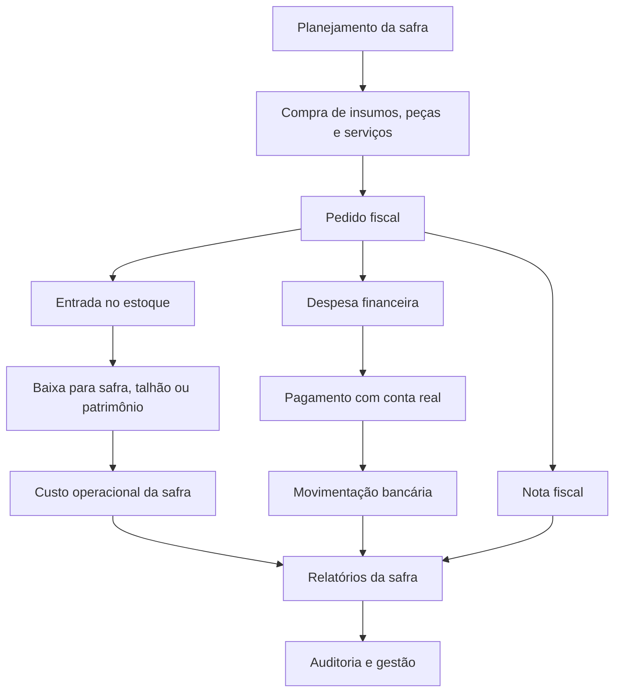

# Instrução de Trabalho — Visão Operacional do Sistema FarmFort

Este documento explica o funcionamento geral do FarmFort ERP Rural usando como referência a lógica da **Baixa de Estoque com Rastreabilidade por Safra**: toda operação importante deve deixar claro **o que entrou**, **onde foi usado**, **em qual propriedade**, **em qual safra**, **quem fez** e **qual impacto financeiro, fiscal, operacional ou produtivo foi gerado**.

## Objetivo

Orientar usuários, gestores, suporte e desenvolvedores sobre como os módulos do FarmFort se conectam para controlar a operação rural de ponta a ponta.

O sistema deve permitir rastrear:

- propriedade/fazenda responsável pela operação;
- safra, talhão, patrimônio ou estoque relacionado;
- pedido, nota fiscal, lançamento financeiro ou movimentação bancária;
- usuário responsável pela ação;
- histórico de alterações por auditoria;
- relatórios gerenciais e operacionais da propriedade.

## Visão geral do FarmFort

## Conceitos principais

### Propriedade

É a fazenda ou unidade rural onde os dados são registrados. Quase todas as informações do sistema precisam estar vinculadas a uma propriedade para impedir mistura de dados entre fazendas.

### Usuário

É a pessoa que acessa o sistema. Cada usuário tem perfil, permissões e vínculo com uma ou mais propriedades conforme a regra administrativa definida.

### Talhão

É a área geográfica da propriedade. Pode ser desenhado no mapa, importado por arquivo geoespacial ou ajustado com áreas excluídas, pivôs e unificação.

### Safra

É o ciclo produtivo. A safra concentra planejamento, talhões, insumos usados, atividades, custos, patrimônio utilizado, colheita e indicadores.

### Pedido fiscal

É o registro de compra antes da confirmação final no financeiro. Ele organiza fornecedor, itens, categorias e possíveis notas fiscais vinculadas.

### Nota fiscal

É o documento fiscal da operação. Pode ser usada para conferir compra, vincular pedido e dar suporte ao lançamento financeiro.

### Produto em estoque

É o item comprado e disponível para uso, como insumo agrícola, peça, combustível, material ou outro produto operacional.

### Patrimônio

É máquina, implemento, veículo, imóvel rural ou equipamento usado pela propriedade. Pode receber manutenção, combustível, peças e custos vinculados.

### Lançamento financeiro

É a receita, despesa ou transferência registrada no financeiro. Ele deve refletir o impacto monetário real ou previsto da operação.

### Conta bancária

É a conta, caixa interno ou investimento usado para registrar entradas, saídas e transferências. Toda baixa de pagamento deve informar a conta real utilizada.

### Auditoria

É o histórico de ações importantes do sistema. Ela registra quem fez, quando fez, em qual propriedade, qual ação executou e quais dados foram afetados.

## Fluxo 1 — Preparar a propriedade para operar

Antes de lançar movimentações, a propriedade precisa estar estruturada.

### Passos recomendados

1. Cadastrar ou revisar a propriedade.
2. Conferir município, estado, latitude e longitude.
3. Vincular usuários autorizados.
4. Definir perfis e permissões.
5. Importar ou desenhar talhões.
6. Criar safra ativa ou safra em planejamento.
7. Cadastrar contas bancárias ou caixa interno.
8. Cadastrar produtos, patrimônios e categorias usadas na operação.

### Resultado esperado

A propriedade fica pronta para receber pedidos, notas, despesas, receitas, estoque, atividades e relatórios sem misturar dados com outra fazenda.

## Fluxo 2 — Talhões, mapa e georreferência

O mapa é a base espacial da produção. Ele mostra onde ficam os talhões, pivôs, áreas excluídas e limites usados nas safras.

### Quando usar

Use o módulo **Talhões** quando precisar:

- cadastrar nova área produtiva;
- importar KML, KMZ ou SHP;
- desenhar polígono no mapa;
- criar área excluída;
- criar ou editar pivô;
- unificar talhões;
- conferir área bruta, área excluída e área líquida;
- impedir edição quando o talhão estiver vinculado a safra em andamento.

### Regra operacional

Se o talhão estiver sendo usado por safra em planejamento ou em andamento, o sistema deve proteger alterações críticas e avisar o usuário. A edição do mapa só deve ocorrer quando não comprometer uma safra ativa.

## Fluxo 3 — Safra e planejamento produtivo

A safra é o centro operacional do ciclo agrícola.

### Quando criar uma safra

Crie uma safra quando houver um novo ciclo de produção, como soja, sorgo, milho, pastagem, abertura de área ou outro cultivo controlado pela propriedade.

### Dados principais

- descrição da safra;
- cultura;
- safra de referência;
- status;
- data inicial e final;
- área plantada;
- produtividade estimada;
- preço estimado;
- talhões usados;
- observações.

### Como a safra se conecta ao sistema

### Resultado esperado

Ao final do ciclo, o usuário deve conseguir saber:

- área plantada;
- insumos comprados;
- insumos usados;
- custos financeiros;
- peças, combustível e patrimônio utilizados;
- produção colhida;
- resultado operacional e financeiro da safra.

## Fluxo 4 — Compras e pedidos fiscais

O pedido fiscal organiza a compra antes de gerar o impacto financeiro definitivo.

### Quando usar

Use **Compras > Pedidos Fiscais** para registrar uma compra de insumo, peça, combustível, serviço, material ou item operacional.

### Fluxo operacional

1. Criar pedido fiscal.
2. Informar fornecedor, CNPJ, data e itens.
3. Definir categoria, unidade, quantidade e valor.
4. Informar se existe nota fiscal antes da aprovação.
5. Conferir divergências entre pedido e nota, quando houver.
6. Aprovar ou rejeitar pedido conforme perfil.
7. Gerar lançamento financeiro.
8. Incorporar produto ao estoque quando aplicável.
9. Registrar auditoria.

### Aprovação

Usuários com perfil de gestão, financeiro ou administração podem aprovar pedidos. Usuários operacionais podem criar pedidos, mas eles ficam aguardando aprovação.

### Nota fiscal vinculada

Quando o pedido tiver NF:

- a nota pode ser vinculada ao pedido;
- o XML pode ser importado para conferência;
- divergências precisam ser confirmadas antes da aprovação;
- o lançamento financeiro deve manter a referência da nota vinculada.

## Fluxo 5 — Fiscal e notas fiscais

O módulo fiscal concentra notas, documentos, certificados e informações fiscais da propriedade.

### Quando usar

Use o fiscal para:

- importar XML de NF-e;
- consultar notas;
- vincular NF ao pedido fiscal;
- armazenar documentos fiscais;
- controlar certificados digitais;
- manter produtores e informações fiscais organizadas.

### Relação com compras e financeiro

### Resultado esperado

O usuário deve conseguir localizar uma operação por pedido, fornecedor, nota fiscal, despesa financeira ou auditoria.

## Fluxo 6 — Estoque de produtos

O estoque controla entradas, saídas, perdas, devoluções e ajustes de produtos.

### Entrada de estoque

A entrada pode acontecer por:

- pedido fiscal aprovado;
- nota fiscal importada;
- lançamento manual autorizado;
- ajuste administrativo controlado.

### Saída de estoque

A saída deve indicar o destino real do produto:

- safra;
- talhão;
- patrimônio;
- manutenção;
- perda;
- devolução;
- ajuste.

### Rastreabilidade por safra

A baixa de estoque precisa responder:

- qual produto saiu;
- qual quantidade saiu;
- de qual propriedade saiu;
- para qual safra foi destinado;
- para qual talhão, quando aplicável;
- para qual patrimônio, quando aplicável;
- qual usuário registrou;
- qual documento ou pedido originou a entrada.

### Documento complementar

O fluxo detalhado está documentado em:

- `docs/instrucao-trabalho-baixa-estoque-safra.md`

## Fluxo 7 — Patrimônio, manutenção e uso na safra

O patrimônio representa máquinas, veículos, implementos, imóveis e equipamentos.

### Quando usar

Use o módulo **Patrimônio** para:

- cadastrar máquinas e equipamentos;
- controlar valor patrimonial;
- registrar manutenção;
- vincular peça usada;
- registrar combustível;
- relacionar custo com safra;
- consultar histórico de uso.

### Exemplo prático

Se um pneu foi comprado e entrou no estoque:

1. O produto entra no estoque.
2. Na manutenção do trator, o usuário baixa o pneu.
3. A baixa informa o patrimônio.
4. Se o trator foi usado em uma safra, a baixa também pode indicar a safra.
5. O relatório da safra passa a considerar esse gasto operacional.

### Resultado esperado

A propriedade consegue responder quanto cada patrimônio consumiu em manutenção, combustível e peças durante uma safra.

## Fluxo 8 — Financeiro

O financeiro centraliza receitas, despesas, transferências, fluxo de caixa, contas bancárias, DRE, comparativos e relatórios.

### Lançamentos financeiros

Um lançamento pode ser:

- despesa;
- receita;
- transferência entre contas.

### Despesas

Despesas podem nascer de:

- pedido fiscal aprovado;
- lançamento manual;
- nota fiscal;
- manutenção de patrimônio;
- operação da safra;
- compra de produto ou serviço.

### Receitas

Receitas podem nascer de:

- venda de produção;
- recebimento financeiro;
- ajuste autorizado;
- outras entradas da propriedade.

### Contas bancárias

As contas registram saldo inicial, entradas, saídas e transferências. Ao confirmar pagamento, o usuário deve informar a conta real usada na saída do dinheiro.

### Transferências

Transferência interna movimenta valor entre contas da propriedade. Ela não deve ser tratada como receita nem como despesa.

### Fluxo de caixa

O fluxo de caixa compara:

- receitas previstas;
- despesas previstas;
- recebido real;
- pago real;
- saldo real;
- acumulado mensal.

## Fluxo 9 — Colheita e produção

A colheita registra a produção realizada em uma safra.

### Quando usar

Use **Colheita** para controlar:

- carga colhida;
- talhão de origem;
- produtor;
- quantidade;
- destino;
- status da entrega;
- relação com contratos e estoque de produção.

### Resultado esperado

O sistema deve permitir comparar o que foi planejado com o que foi colhido e vendido.

## Fluxo 10 — Estoque de produção e contratos

O estoque de produção controla contratos, entregas e saldo de produção agrícola.

### Quando usar

Use quando a propriedade tiver venda contratada, entrega parcial ou controle de produção disponível.

### O que controlar

- contrato;
- comprador;
- quantidade contratada;
- quantidade entregue;
- saldo;
- status do contrato;
- vínculo com safra e cultura.

## Fluxo 11 — Usuários e permissões

Usuários devem enxergar apenas dados das propriedades onde possuem acesso.

### Regras operacionais

- Um usuário comum não deve visualizar dados de outra propriedade.
- Perfis financeiros devem ter permissão adequada para operar o financeiro da propriedade.
- Ações críticas precisam respeitar permissão.
- Alterações em usuários, vínculos e perfis devem gerar auditoria.
- O sistema nunca deve exibir senha já cadastrada.

### Perfis comuns

- gestor da propriedade;
- administrador;
- gestão;
- financeiro;
- produtor;
- colaborador;
- visualizador.

## Fluxo 12 — Auditoria

A auditoria registra ações importantes para permitir rastreabilidade e investigação.

### O que deve ser auditado

- login e logout;
- criação e alteração de usuários;
- alteração de permissões;
- criação, aprovação e rejeição de pedidos;
- vínculo de nota fiscal;
- geração de lançamento financeiro;
- pagamento e recebimento;
- baixa de estoque;
- alteração de safra;
- edição de talhão;
- alteração de propriedade;
- ações administrativas críticas.

### O que a auditoria deve responder

- quem fez;
- quando fez;
- em qual propriedade;
- qual ação foi executada;
- qual registro foi afetado;
- qual rota e método foram usados;
- qual IP real foi identificado;
- quais dados mudaram, sem gravar senha ou informação sensível.

## Fluxo 13 — Dashboard, indicadores e relatórios

O dashboard e os relatórios consolidam os dados operacionais.

### Relatórios esperados

- resultado da safra;
- fluxo de caixa;
- DRE;
- comparativo de safras;
- orçado x realizado;
- lançamentos financeiros;
- movimentação bancária;
- entradas e saídas de estoque;
- insumos usados por safra;
- custos por patrimônio;
- pedidos fiscais;
- notas fiscais vinculadas;
- auditoria.

### Princípio de conferência

Se um relatório estiver errado, o usuário deve conseguir voltar até a origem:

## Rotina recomendada de uso

### Rotina diária

1. Conferir pedidos pendentes.
2. Aprovar ou rejeitar pedidos após análise.
3. Registrar notas fiscais recebidas.
4. Conferir despesas vencidas.
5. Baixar pagamentos somente após saída real da conta.
6. Registrar entradas e saídas de estoque.
7. Conferir alertas de auditoria e suporte.

### Rotina semanal

1. Conferir fluxo de caixa.
2. Validar saldos bancários.
3. Revisar estoque crítico.
4. Conferir consumo de insumos por safra.
5. Revisar manutenção e uso de patrimônio.
6. Conferir lançamentos sem safra ou sem conta.

### Rotina por safra

1. Criar safra e vincular talhões.
2. Registrar compras e entradas de estoque.
3. Baixar insumos usados por safra e talhão.
4. Registrar uso de patrimônio, peças e combustível.
5. Acompanhar despesas e receitas vinculadas.
6. Registrar colheita.
7. Fechar relatórios operacionais e financeiros.

## Como o ciclo completo fecha

## Boas práticas para o usuário

- Sempre selecionar a propriedade correta antes de lançar qualquer informação.
- Informar safra sempre que a operação estiver relacionada ao ciclo produtivo.
- Informar talhão quando o consumo for localizado.
- Informar patrimônio quando houver uso de máquina, peça ou manutenção.
- Nunca marcar despesa como paga antes do dinheiro sair da conta.
- Conferir saldo da conta antes da baixa.
- Vincular nota fiscal ao pedido sempre que houver documento fiscal.
- Usar observações para explicar exceções operacionais.
- Corrigir lançamentos sem safra, sem conta ou sem origem documental.
- Evitar lançamentos duplicados.

## Alertas importantes

- Pedido fiscal não é pagamento.
- Nota fiscal não é baixa financeira.
- Transferência entre contas não é receita nem despesa.
- Estoque comprado não significa estoque usado.
- Baixa de estoque sem destino perde rastreabilidade.
- Despesa paga sem conta bancária perde controle financeiro.
- Safra sem talhão reduz a precisão dos relatórios.
- Patrimônio sem vínculo de uso dificulta apuração de custo operacional.

## Documentos complementares

- `docs/instrucao-trabalho-baixa-estoque-safra.md`
- `docs/pedidos-fiscais-fluxo.md`
- `docs/financeiro-lancamentos-legado.md`
- `docs/financeiro-fluxo-caixa-legado.md`
- `docs/security.md`
- `docs/testing.md`
- `docs/project-map.md`

## Critérios de aceite operacional

O sistema estará sendo usado corretamente quando:

- cada operação estiver vinculada à propriedade correta;
- compras com impacto financeiro gerarem pedido, nota ou despesa rastreável;
- baixas de estoque informarem destino real;
- despesas pagas indicarem a conta real usada;
- relatórios da safra mostrarem custos vindos de financeiro, estoque e patrimônio;
- usuários não acessarem dados de outras propriedades;
- ações críticas estiverem registradas na auditoria;
- gestores conseguirem explicar a origem de cada número apresentado nos relatórios.

